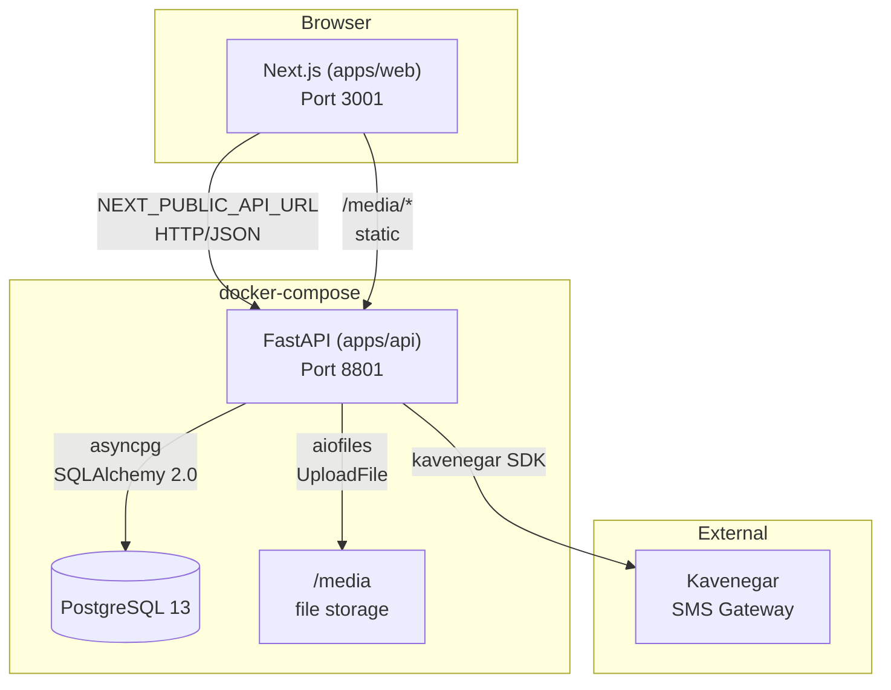
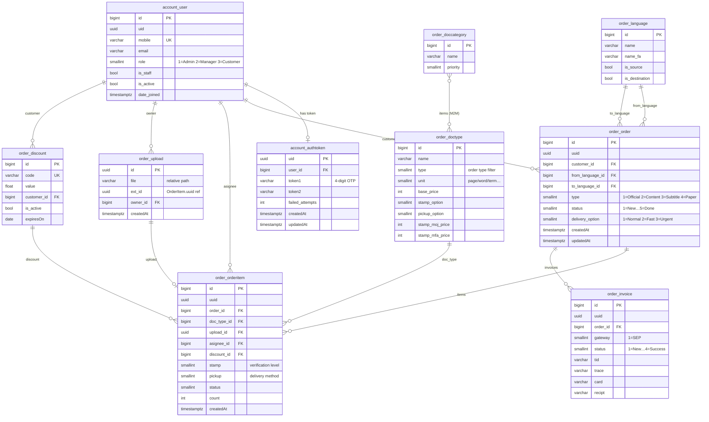
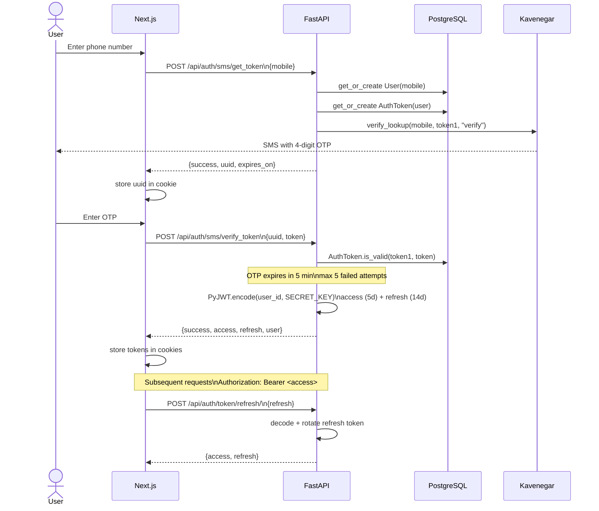
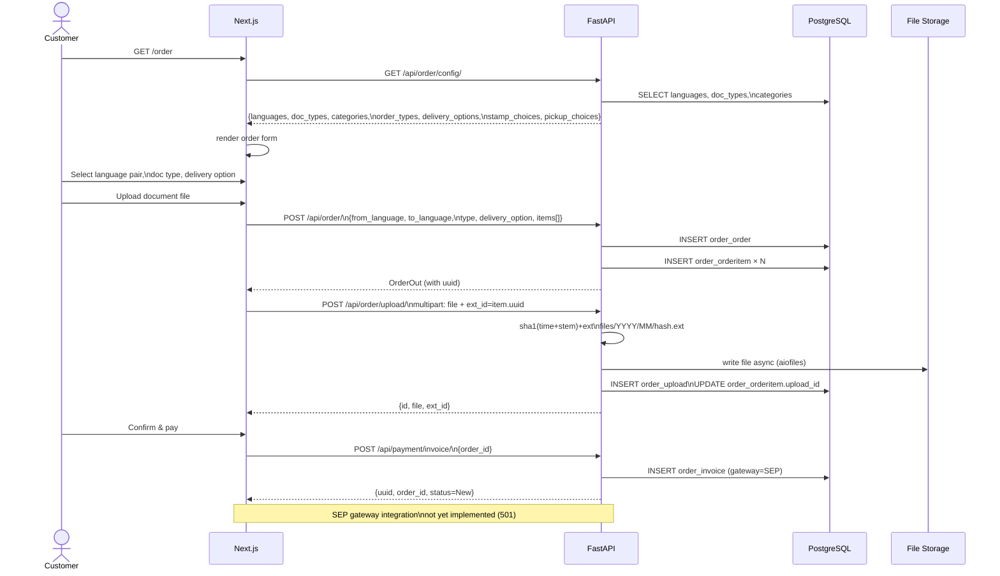
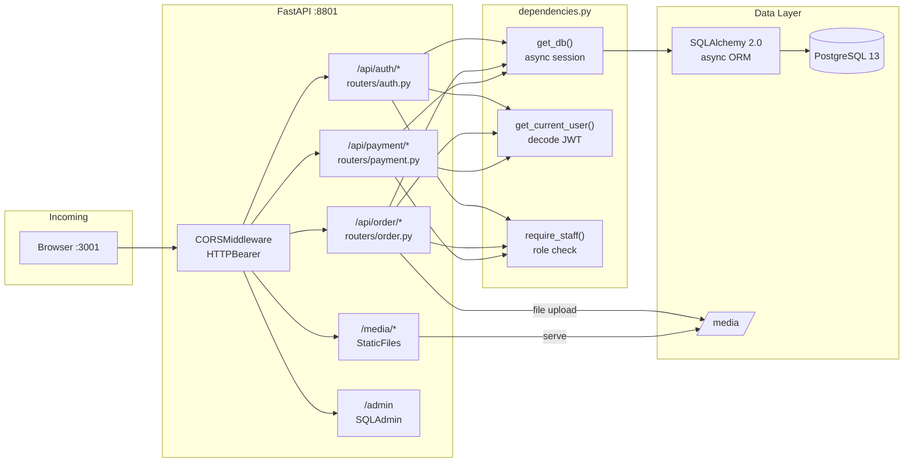

# Dilma

Translation management platform — customers submit translation orders, freelance translators fulfill them. Supports official translation, content creation, subtitling, and academic papers.

> **Disclaimer:** Published for demonstration. Repo history purged for privacy. Other colleagues contributed to the original build.

---

## Stack

| Layer | Technology |
|---|---|
| Frontend | Next.js 12, TypeScript, Redux, MUI 5, RTL (Persian) |
| Backend | FastAPI 0.115+, SQLAlchemy 2.0 async, Alembic |
| Database | PostgreSQL 13 |
| Auth | SMS OTP (Kavenegar) → JWT (PyJWT HS256) |
| Container | Docker + docker-compose |
| CI/CD | Azure Pipelines → Hetzner VPS (SSH) |
| Tooling | uv (Python), pnpm (Node), Taskfile, lefthook |

---

## Repository Structure

```
dilma/
├── apps/
│   ├── api/                  ← FastAPI backend
│   │   ├── src/api/
│   │   │   ├── config.py     ← pydantic-settings
│   │   │   ├── main.py       ← app factory, middleware
│   │   │   ├── dependencies.py  ← get_db, auth guards
│   │   │   ├── models/       ← SQLAlchemy ORM
│   │   │   ├── schemas/      ← Pydantic v2 I/O
│   │   │   ├── routers/      ← auth · order · payment
│   │   │   ├── services/     ← jwt · sms (Kavenegar)
│   │   │   └── admin.py      ← SQLAdmin
│   │   ├── alembic/          ← DB migrations
│   │   └── tests/
│   └── web/                  ← Next.js frontend
│       ├── pages/            ← file-based routing
│       ├── components/       ← UI components
│       ├── redux/            ← global state
│       └── lib/api.ts        ← API base URLs
├── packages/                 ← shared libs (reserved)
├── Taskfile.yml              ← dev commands
├── docker-compose.yml        ← unified services
├── pyproject.toml            ← uv workspace root
└── pnpm-workspace.yaml
```

---

## Architecture



---

## Data Model



---

## Authentication Flow

SMS-based two-step login — no passwords.



---

## Order Creation Flow



---

## Request Routing



---

## API Reference

### Auth  `POST /api/auth/...`

| Endpoint | Auth | Description |
|---|---|---|
| `POST /sms/get_token` | Public | Request OTP for phone number |
| `POST /sms/verify_token` | Public | Verify OTP → returns JWT pair |
| `POST /token/refresh/` | Public | Rotate refresh token → new pair |
| `GET /users/` | Staff | Paginated user list (excludes superusers) |

### Order  `GET/POST /api/order/...`

| Endpoint | Auth | Description |
|---|---|---|
| `GET /config/` | Public | Languages, doc types, categories, choices |
| `GET /` | Optional | List orders (staff=all, customer=own) |
| `GET /{pk}/` | Optional | Single order detail |
| `POST /` | Optional | Create order + items |
| `GET /langs/` | Public | Language list |
| `GET /types/` | Public | DocType list (optional `?type=` filter) |
| `GET /cats/` | Public | DocCategory list with item IDs |
| `POST /upload/` | Optional | Upload file → link to OrderItem |

### Payment  `POST /api/payment/...`

| Endpoint | Auth | Description |
|---|---|---|
| `POST /invoice/` | Public | Create invoice record (gateway=SEP) |
| `GET /verify/` | Public | `501` — SEP integration pending |

---

## Development

**Prerequisites:** `uv`, `pnpm`, `docker`, `task` (Taskfile)

```bash
# Bootstrap all dependencies
task setup

# Start everything (docker compose)
task dev

# Individual services
task py:dev       # FastAPI on :8000 (hot reload)
task ts:dev       # Next.js on :3000 (hot reload)

# Quality
task lint         # ruff + eslint (parallel)
task py:test      # pytest

# Database
task py:migrate   # alembic upgrade head
task py:migration -- "add column x"  # generate revision

# Production cutover (run once against live DB)
task py:stamp     # alembic stamp head — marks existing DB as migrated
```

**Environment (`apps/api/.env`):**

```env
DATABASE_URL=postgresql+asyncpg://user:password@db/dilma
SECRET_KEY=your-secret-key
KAVEHNEGAR_API_KEY=your-kavenegar-key
DEBUG=1
ALLOWED_ORIGINS=http://localhost:3000
MEDIA_ROOT=/usr/src/app/media
POSTGRES_DB=dilma
POSTGRES_USER=user
POSTGRES_PASSWORD=password
```

**Docker:**

```bash
# Build context must be repo root (uv workspace resolution)
docker build -f apps/api/Dockerfile .
docker compose up --build
```

---

## JWT Token Structure

Tokens are HS256-signed, compatible with the frontend cookie storage.

```json
{
  "token_type": "access",
  "user_id": 42,
  "exp": 1234567890,
  "iat": 1234567890,
  "jti": "uuid4"
}
```

- Access token lifetime: **5 days**
- Refresh token lifetime: **14 days**
- Refresh tokens **rotate** on each use
